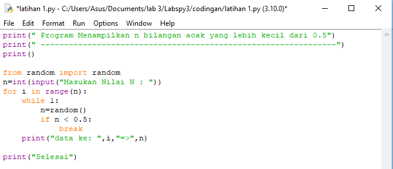
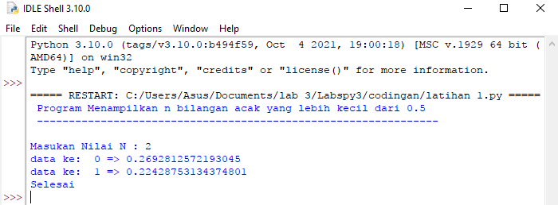
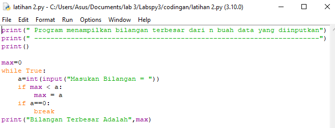
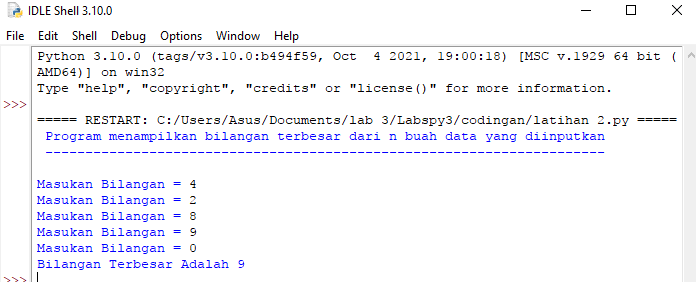
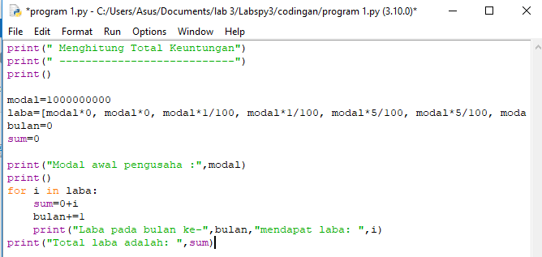
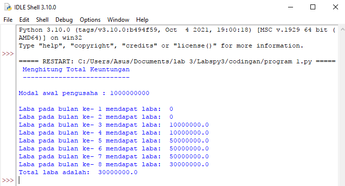

# Labspy3

## Latihan 1
-Program Menampilkan n Bilangan acak yang lebih kecil dari 0.5

## Program

## Hasil

## Penjelasan
-Import module random untuk membuat bilangan acak

from random import random

-Untuk menginput nilai yang ingin dikonversikan kedalam bilangan bulat (Integer) yang akan di masukan kedalam variabel n

n=int(input("Masukan Nilai N : "))

-Untuk pengulangan range yang diinputkan oleh variable n

for i in range(n):
    while 1:
        n=random()
        if n < 0.5:

-Menampilkan hasil dari nMenampilkan hasil dari n

print("data ke: ",i,"=>",n)

## Latihan 2
-Menampilkan Bilangan terbesar dari n buah data yang diinputkan

## Program

## Hasil

## Penjelasan
-Deklarasikan Variabel

max=0

-Untuk perulangan sampai waktu yang tidak terhitung (While Loop)

while True:

-Untuk menginput bilangan yang akan dimasukan kedalam variabel a

a=int(input("Masukan bilangan = "))

Apabila max kurang dari a, maka variabel max = a (angka yang diinputkan)

if max < a:
        max = a

-Jika a = 0, maka perulangan (loop) akan dihentikan dengan fungsi break

if a==0:
        break

-Menampilkan hasil bilangan terbesar dari variabel max

print("Bilangan Terbesar Adalah", max)

## Program 1
-Program Menghitung Total Keuntungan

## Program

## Hasil

## Penjelasan
-Dari variabel Laba terdapat list modal dari bulan kesatu sampai terakhir

modal=100000000
laba=[modal*0, modal*0, modal*1/100, modal*1/100, modal*5/100, modal*5/100, modal*5/100, modal*3/100]
bulan=0
sum=0

-Menampilkan modal pertama yang diambil dari variabel modal

print("Modal awal pengusaha : ",modal)

-Untuk melakukan perulangan variabel i kedalam variabel laba. agar variabel i mendapat akses list yang ada didalam variabel laba

for i in laba:

-Variabel sum ditambahkan dengan variabel i yang akan diulang hingga program selesai

sum = sum + i

-Variabel bulan, untuk menentukan bulan yang akan ditambahkan dengan nilai 1 terus menerus hingga program berakhir

bulan+=1

-Menampilkan laba dari bulan pertama hingga bulan terakhir

print("Laba pada bulan ke-",bulan,"mendapat laba: ",i)

-Menampilkan total laba/keuntungan yang di dapat selama 8 bulan

print("Total laba adalah: ", sum)

## SELESAI